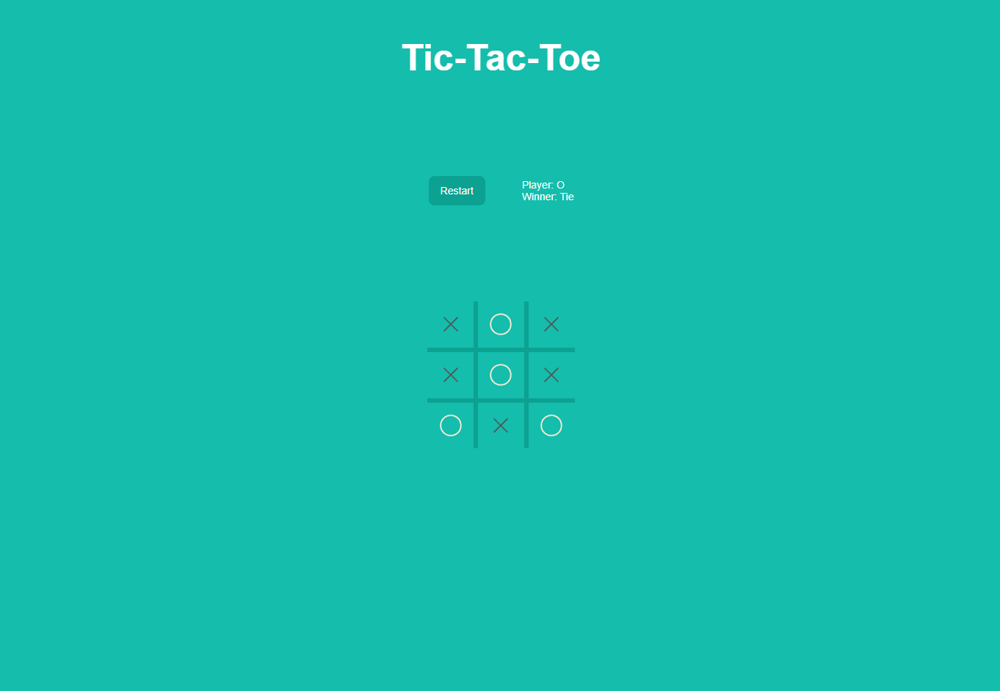

<h1 align="center">Tic-Tac-Toe #</h1>

<div align="center">



This project is part of my learning in Angular, where I am developing a tic-tac-toe game using the technologies and concepts learned during my study.

</div>

## ✨ Features

- Tic-Tac-Toe game.

## 📦 Running Locally

First, Install the node_modules

```bash
$ npm install
```

Then,

```bash
$ npm start
```

Finally, open your browser and visit http://localhost:4200/

## ⌨️ Development

- Angular core Features.

## 🤝 Contributing

<table>
  <tr>
    <td align="center">
      <br />    
      <sub>
        <b>Leonardo Arruda</b>
      </sub>    
      <br />
    </td>
  </tr>
</table>

Follow me on <a href="https://github.com/LeonardoArrudaMesquita">Github</a> and <a href="https://www.linkedin.com/in/leonardo-arruda-40053b146/">Linkedin</a>!
